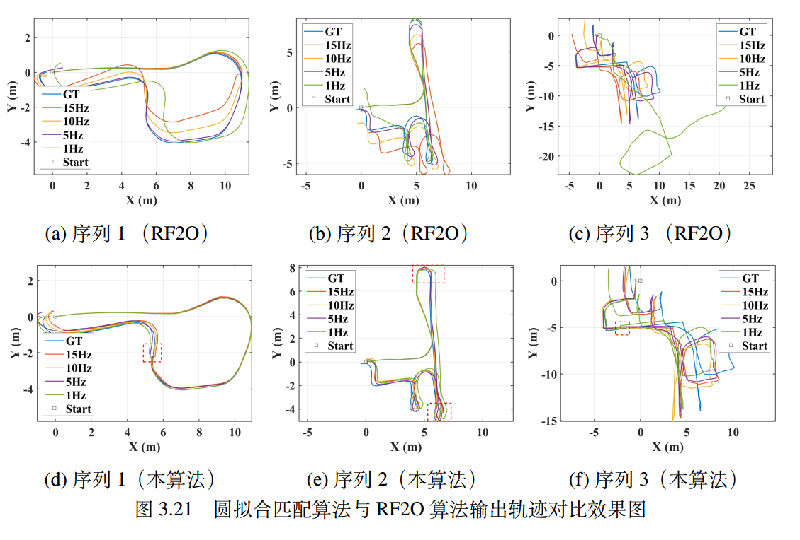

# circle_odometry

This repo is for our IEEE/ASME Trans. Mechatronics submission of "Circle fit matching: a fast analytical laser scan matching method for 2D laser scanners".

## Working Principle


## Dependencies

* ROS
* Eigen3
* PCL 1.8
* YAML-CPP

## Build This Program

```
mkdir -p circle_odom_ws/src/ && cd circle_odom_ws/src/
git clone https://github.com/bzdfzfer/circle_odometry
cd ~/circle_odom_ws/ && catkin_make -DCMAKE_BUILD_TYPE=Release
```

## Run This Program

```
source devel/setup.bash
roslaunch circle_odometry circle_odometry.launch 
# Open another terminal.
cd ~/circle_odom_ws/src/circle_odometry/rviz_cfg/
rviz -d circle_odom.rviz
rosbag play scene1.bag --clock 
```


## Dataset Downloading

* TODO (add  links for three rosbags)

  

## Some Results

#### Comparison with RF2O



#### Degneration processing results


